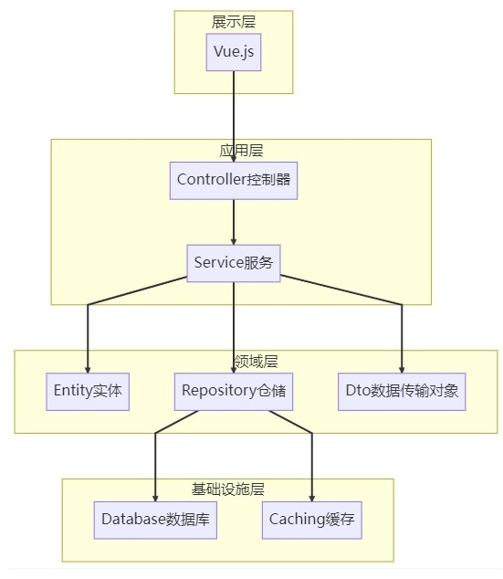

# 项目结构图
## 项目初始架构图
通过使用最常规的**B/S架构**的形式， 通过Vue来实现展示层的浏览器展示效果 ，以及通过使用SpringBoot实现服务器层面的信息回现。
在服务器层， 通过使用最简单的MVC三层架构的形式实现
**表现层、业务逻辑层和数据访问层**

1. 表现层：这里通过Controller层实现。负责接收用户请求，展示页面和处理表单提交。表现层与用户直接交互，负责处理HTTP请求和响应，控制页面呈现和跳转。
2. 业务逻辑层：这里通过Service层实现。负责处理具体的业务逻辑，包括数据校验、业务处理、事务处理等。业务逻辑层通常与表现层和数据访问层进行交互，接收表现层的请求，调用数据访问层获取数据，并进行业务逻辑处理。
3. 数据访问层：使用了ORM框架，对应实体类通过pojo实现。负责与数据库进行交互，对数据进行增删改查操作。数据访问层通常与业务逻辑层进行交互，接收业务逻辑层的请求，获取数据并进行操作。

## 模块基本信息
### 书籍管理模块
模块描述：负责对书籍进行增删改查等基本操作，包括书籍信息的录入、维护和展示，书籍图片的上传、展示和删除，书籍状态的管理等功能。
### 书籍分类模块
模块描述：负责书籍分类的管理，包括书籍分类的层级关系维护、新增、修改、删除等基本操作。
### 订单管理模块
模块描述：负责订单相关的基础操作，包括订单的查询、创建、删除等功能。
### 用户管理模块
模块描述：负责用户信息相关功能，包括用户注册、登录、个人信息维护等操作。
### 购物车管理模块
模块描述：负责购物车的管理，包括加入购物车、调整书籍数量、删除书籍、结算等基本操作。